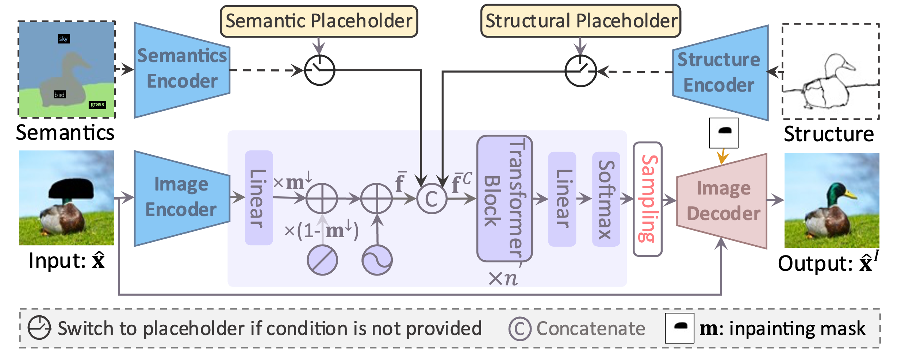

## News
[10/05/2024] The main branch has been updated to support our TPAMI2024 paper. Currently, only the uncontrollable image inpainting models are provided. The models and the codes for controllable image inpainting will come soon. Please be patient. The origin repository for CVPR2022 paper is avaliable at this [url](https://github.com/liuqk3/PUT/tree/cvpr2022).

[21/04/2024] The extension paper "Transformer based Pluralistic Image Completion with Reduced Information Loss" has been accepted to TPAMI 2024. The final PDF is avaliable on [arXiv](https://arxiv.org/abs/2404.00513). The improved PUT inpaints images with much better quality with 20x less inference time! The controllable image inpainting is also supported. In addition, more discussions are provided, including the comparison with some popular mask image modeling methods. The code will be updated when I am free. Please be patient.

## Introduction

This repo. is the official implementation of our CVPR 2022 paper [Reduce Information Loss in Transformers for Pluralistic Image Inpainting](https://arxiv.org/abs/2205.05076) and TPAMI 2024 paper [Transformer based Pluralistic Image Completion with Reduced Information Loss](https://arxiv.org/abs/2404.00513). It is also a codebase for several tasks, especially friend to image synthesis tasks. 

In our interal works, we have re-implented several works with the help of this repo., including [ICT](https://github.com/raywzy/ICT), [DALL-E](https://arxiv.org/abs/2102.12092), [Taming-transformers](https://github.com/CompVis/taming-transformers), [Edge-Connect](https://github.com/knazeri/edge-connect), and so on. 

Enjoy the code and find its convience to produce more awesome works!

## Overview
### Pipeline for uncontrollable image inpainting
<!--  -->


## Pipeline for controllable image inpainting
<!--  -->


##  Some results

- Results for resolution 256x256, uncontrollable.


- Results for resolution 512x512, uncontrollable.


- Results for resolution 256x256, controllable.


- Effectiveness of unknown category strategy in controllable image inpainting.


## Data preparation
Please ref. [prepare_data](readme/prepare_data.md) for details.

## Installation
Ref. [install_instruction.sh](readme/install_instruction.sh).


## Training

For each dataset, the training procedure is divideded into two stages: (1) Training of P-VQVAE, and (2) Training of UQ-Transformer. And the training of UQ-Transformer needs the pre-trained P-VQVAE. The training command is very simple like this:

```
python train_net --name exp_name --config_file path/to/config.yaml --num_node 1 --tensorboard --auto_resume
```

For example:

```
python train_net --name cvpr2022_p_vqvae_ffhq --config_file configs/put_cvpr2022/ffhq/p_vqvae_ffhq.yaml --num_node 1 --tensorboard --auto_resume
```

You can also modify the configures in the given yaml file:

```
python train_net --name cvpr2022_p_vqvae_ffhq --config_file configs/put_cvpr2022/ffhq/p_vqvae_ffhq.yaml --num_node 1 --tensorboard --auto_resume dataloader.batch_size 2 solver.base_lr 1.0e-4 dataloader.data_root DATASET
```

NOTE: The training settings are total controlled by the given yaml config file. So making a good yaml config file is quite important! The trained logs, models, and sampled images are all saved to `./OUTPUT/exp_name`.

The default training commands are provided in [scripts/train_commands_cvpr2022.sh](scripts/train_commands_cvpr2022.sh) and [scripts/train_commands_tpami2024.sh](scripts/train_commands_tpami2024.sh). Note that the batch size, number of nodes, and the number of GPUs should be adjusted according to your machine.


## Inference
We provide several inference functions in `./scripts/inference.py`. First of all, you need to train a model or download the pretrained model from [OneDrive](https://mailustceducn-my.sharepoint.com/:f:/g/personal/liuqk3_mail_ustc_edu_cn/EjmcxzE9T_pJunLoVKCxgm4BJt6VRM7cBL2cf3BsSdOarw?e=a3Ynvu), 
or [BaiduYunpan](https://pan.baidu.com/s/1QoxqW66au7wVRqk3POQung) (code: `6po2`) and put them into `./OUTPUT/`.

1) For image reconstruction:

```
python scripts/inference.py --name OUTPUT/pvqvae_exp_name/checkpoint/last.pth --func inference_reconstruction --gpu 0 --batch_size 8
```

2) For image inpainting with provided/trained transformer model:

```
python scripts/inference.py --func inference_inpainting \
--name  OUTPUT/transformer_exp_name/checkpoint/last.pth \
--input_res 256,256 \
--num_token_per_iter 1 \                                                # if given like '1,2,5', the script will loop for each of them
--num_token_for_sampling 50 \                                           # if given like '50,100', the script will loop for each of them
--image_dir path/to/images \
--mask_dir path/to/masks \
--save_masked_image \                                                   # whether to save the masked images 
--save_dir path/to/save \
--num_sample 1 \                                                        # the number of inpainted results for each image-mask pair
--gpu 0                                                                 # GPU ID to use. If not given, DDP is performed   
```
The results will be saved to `./RESULTS/transformer_exp_name/path/to/save`. Please refer [scripts/inference_commands_cvpr2022.sh](scripts/inference_commands_cvpr2022.sh) and [scripts/inference_commands_tpami2024.sh](scripts/inference_commands_tpami2024.sh) for more details. Some image-mask pairs are provided for each dataset in `./data`, you can try to inpaint some images with the provided commands in `scripts/inference_commands_cvpr2022.sh` and `scripts/inference_commands_tpami2024.sh` (the models need to be downloaded and putted into `./OUTPUT`).

## Evaluation
After some results have be generated, the metrics can be obtained by:

```
sh scripts/metrics/cal_metrics.sh path/to/gt path/to/result
```

The diversity can be evaluted by:

```
python scripts/metrics/cal_lpips.py  --path1 path/to/results_dir  --device cuda:0
```


## Citation

If you find our paper/code are helpful, please consider citing:

```
# TPAMI paper
@article{liu2024transformer,
  title={Transformer based Pluralistic Image Completion with Reduced Information Loss},
  author={Liu, Qiankun and Jiang, Yuqi and Tan, Zhentao and Chen, Dongdong and Fu, Ying and Chu, Qi and Hua, Gang and Yu, Nenghai},
  journal={IEEE Transactions on Pattern Analysis and Machine Intelligence},
  year={2024},
  publisher={IEEE}
}

# CVPR paper
@article{liu2022reduce,
  title={Reduce Information Loss in Transformers for Pluralistic Image Inpainting},
  author={Liu, Qiankun and Tan, Zhentao and Chen, Dongdong and Chu, Qi and Dai, Xiyang and Chen, Yinpeng and Liu, Mengchen and Yuan, Lu and Yu, Nenghai},
  booktitle={IEEE Conference on Computer Vision and Pattern Recognition (CVPR 2022)},
  year={2022}
}
```